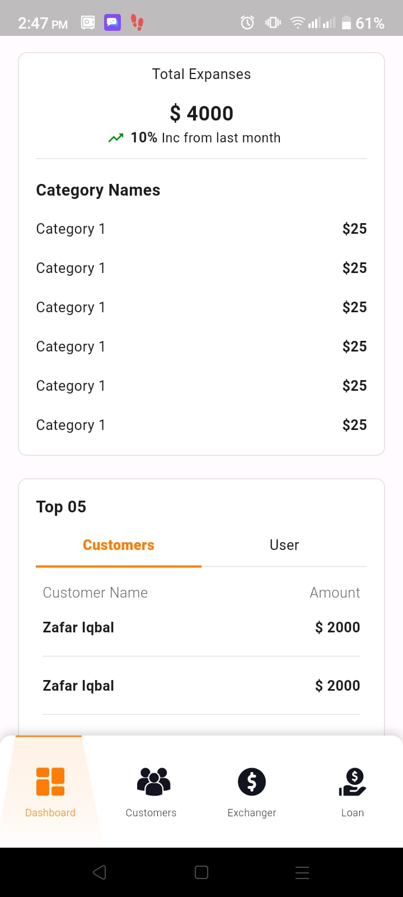
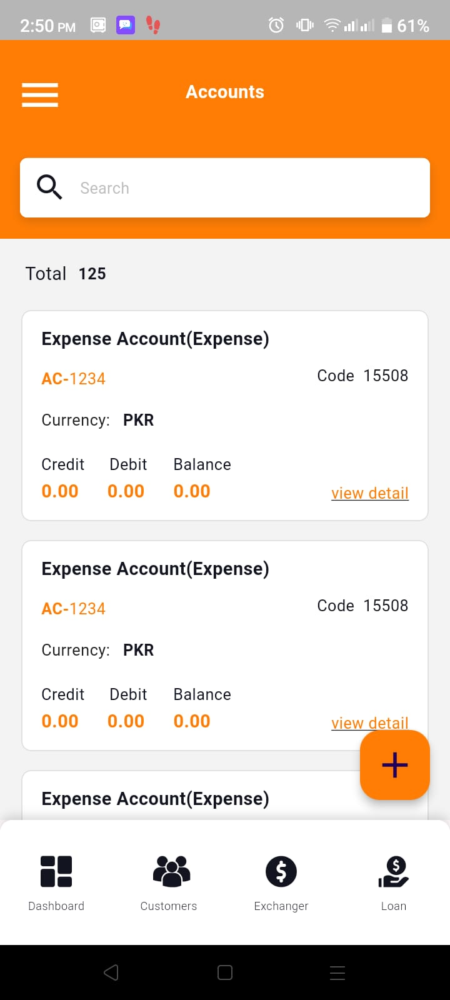

# Currency-Exchange

INTRODUCTION

Currency exchange is a licensed business that allows customers to exchange one currency for another by executing buy and sell transactions. The purpose of this system is to properly define the IN and OUT cash flow in the system. Also to keep record of all the accounting related activities.

KEY FEATURES:

1. Manage Currency exchange from customer
2. Manage Bank exchange transactions
3. Manage Accounting Entries
4. Manage IN-OUT cash Flow
5. Manage Expenditures 
6. Manage Loan

TECHNOLOGIES & TOOLS USED

1. Flutter
2. Dart
3. Firebase
4. FCM

SCREENSHOTS

                           
